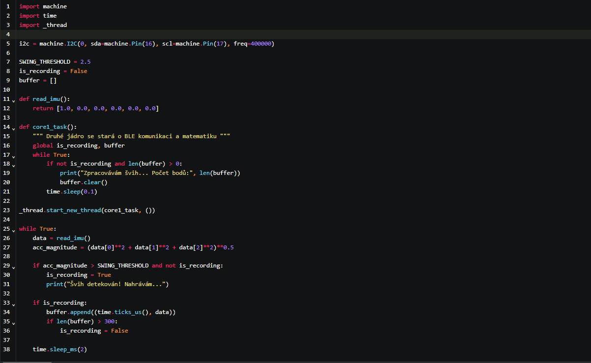
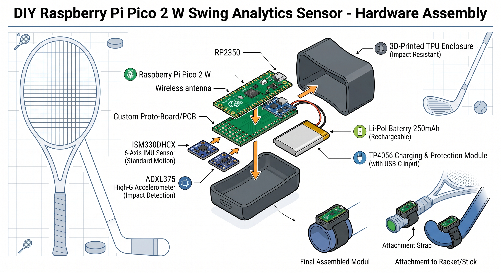

# Mikrokontrolery v pálkovacích sportech
## Cíl projektu
Projekt porovná profesionální systémy (např. Zepp Tennis nebo Blast Motion) s DIY řešením, kompaktním modulem, který se připevní na konec sportovního náčiní (tenisová raketa, hokejka, golfová hůl). Zařízení měří úhlovou rychlost a přetížení při úderu a pomocí Bluetooth (BLE) posílat data do aplikace pro vizualizaci dráhy švihu.
## Průzkum
### Komerční systémy
Profesionální řešení se zaměřují na extrémní miniaturizaci, aerodynamiku a pokročilé softwarové algoritmy pro rozpoznávání typů úderů.
- **Příklad**: Zepp Tennis, Blast Motion, Garmin TruSwing
- **Typ zařízení**: Malý modul (často tvaru "mince" nebo válečku) pevně nacvaknutý na koncovku (butt cap) rakety nebo hokejky.
- **Primární senzory**: 6-osé až 9-osé IMU jednotky. Často kombinují standardní akcelerometr pro plynulý pohyb a speciální High-G akcelerometr (schopný měřit přetížení až do +- 100g nebo 200g) pro zachycení tvrdého nárazu do míčku/puku.
- **Sledované metriky**: Rychlost švihu (km/h), úhlová rychlost rotace, úhel sklonu pálky v momentě impaktu, čas nápřahu vs. švihu (tempo) a 3D trajektorie pohybu.
- **Zpracování dat**: Výkonné jednočipové mikrokontrolery s nízkou spotřebou (např. Nordic Semiconductor nRF řady). Data jsou filtrována přímo v čipu a odesílána v reálném čase.
- **Přesnost**: Extrémně vysoká vzorkovací frekvence (často 1000 Hz a více), která zachytí i mikrosekundový moment úderu.
- **Cena**: 4 500 Kč – 8 000 Kč za senzor + často nutné předplatné za pokročilé analýzy v aplikaci.
### DIY projekt
Napodobění těchto funkcí s využitím nového čipu RP2350 s jádry ARM Cortex-M33, která mají hardwarovou podporu pro matematické operace s plovoucí čárkou (FPU), což je ideální pro rychlé výpočty trajektorie.
- **Typ zařízení**: 3D tištěné pouzdro s integrovaným upevněním (např. pomocí pružného TPU materiálu) na konec hokejky či rakety.
- **Primární senzory**: STMicroelectronics LSM6DSOX nebo ISM330DHCX (6-osé průmyslové IMU). Tyto senzory obsahují vestavěný strojek pro strojové učení (Machine Learning Core), který dokáže sám detekovat švih bez zatížení hlavního procesoru.
- **Mikrokontroler**: Raspberry Pi Pico 2 W. Nabízí dostatek výkonu pro složitou integraci zrychlení na rychlost a bezdrátové BLE vysílání.
- **Zpracování dat**: Využívá se tzv. Madgwickův nebo Kalmanův filtr pro fúzi dat z akcelerometru a gyroskopu. Výsledkem jsou kvaterniony (3D orientace), ze kterých aplikace vykreslí dráhu švihu
- **Komunikace**: Bluetooth Low Energy (BLE) integrované na Pico 2 W. Data se streamují do mobilní aplikace (či Python skriptu v PC) s nízkou latencí.
- **Cena**: 600 – 900 Kč za kompletní komponenty (Pico 2 W, IMU senzor, malá Li-Pol baterie, nabíjecí modul).
## Hlavní chyby a problémy u DIY řešení
1. **Saturace (přesycení) senzoru při nárazu**
- Problém: Běžně dostupné levné IMU senzory (např. MPU-6050) mají limit akcelerometru +- 16g. Při tvrdém úderu hokejkou do puku nebo raketou do tenisáku však vzniká rázové přetížení přesahující 50g až 100g. Graf zrychlení se v momentě úderu "zploští" (ořízne) a výpočet rychlosti selže.
- Řešení: Použití senzoru s vyšším rozsahem (např. LSM6DSOX zvládá sice standardně méně, ale průmyslové varianty či sekundární dedikované High-G čipy jako ADXL375 zvládnou až +- 200g). V kódu se pak implementuje logika: jemný pohyb (nápřah) měří citlivé IMU, samotný hit (náraz) změří High-G senzor.
2. **Latence přenosu dat přes BLE**
- Problém: Pokud se Pico 2 W pokouší posílat surová data (RAW data ze senzoru) při frekvenci 1000 Hz přes Bluetooth do mobilu, dojde k zahlcení bezdrátového kanálu, ztrátě paketů a trhání vizualizace.
- Řešení: Využití dvou jader Pico 2 W (Multicore):
Jádro 0: Pouze čte data ze senzoru na maximální rychlosti a ukládá je do kruhového bufferu v RAM (funguje jako černá skříňka).
Jádro 1: Detekuje moment úderu. Jakmile úder skončí, jádro 1 data zkomprimuje, spočítá klíčové metriky (max. rychlost, úhel) a odešle balíček dat přes BLE až po odehrání švihu, čímž nezatěžuje proces měření.
3. **Destruktivní vibrace a upevnění**
- Problém: Tvrdé rány (zejména v hokeji nebo baseballu) generují vysokofrekvenční vibrace, které mohou poškodit pájené spoje na Pico 2 W, nebo způsobit, že se senzor uvnitř krabičky mírně pohne, což znehodnotí kalibraci osového systému.
- Řešení: Elektronika musí být v pouzdře pevně fixována (např. zalita do speciální elektronické pryskyřice nebo silikonu). Pouzdro samotné se tiskne z flexibilního materiálu TPU, který funguje jako mechanický tlumič nejostřejších rázů.
## Porovnání DIY vs. Komerční
### Srovnání: Komerční vs. DIY řešení pro analýzu švihu
| Zařízení | Komerční systém (Zepp / Blast) | DIY Řešení (Pico 2 W + LSM6DSOX) |
| :--- | :--- | :--- |
| **Čip / Výkon** | Optimalizovaný ultra-low power ARM čip | *RP2350 (Cortex-M33)* – obrovský výpočetní výkon pro filtraci dat za sekundu |
| **Senzorika** | Kombinace Low-G a High-G IMU senzorů | Pokročilé 6-osé IMU (LSM6DSOX) s možností rozšíření o High-G čip |
| **Frekvence čtení** | 1000 Hz+ | *500 – 1600 Hz* (plně konfigurovatelné v C++/MicroPythonu) |
| **Zpracování dat** | Uzavřené cloudové algoritmy výrobce | Vlastní open-source filtry (Madgwick, Kalman) běžící přímo na Pico |
| **Konektivita** | Bluetooth LE (uzavřený protokol) | *Bluetooth LE* (otevřený protokol, možnost posílat do jakékoliv aplikace/PC) |
| **Rozměry a váha** | Extrémně malé a lehké (cca 6–10 g) | Větší (cca 25–40 g včetně baterie) – může mírně ovlivnit vyvážení rakety |
| **Vizualizace** | Hotová animovaná 3D aplikace s grafy | Vlastní skript (např. v Pythonu přes knihovnu *Pygame* nebo *Three.js* v prohlížeči) |
| **Cena HW** | 5 000 Kč+ (+ roční licence) | *600 – 900 Kč* za kompletní hardware |
| **Cena práce (vývoj)** | Zahrnuta v ceně produktu | **~12 000 Kč+** (vyčíslení 60+ hodin vývoje: ladění filtrů, kalibrace, 3D tisk a programování BLE) |
## Příklad kódu v MicroPythonu
Tento zjednodušený skript ukazuje, jak Pico 2 W monitoruje zrychlení, a pokud detekuje prudký pohyb (švih), spustí vysokorychlostní záznam pro pozdější odeslání.
 S kódem mi pomohlo Google Gemini
## Příklad jak by vypadalo DIY řešení
 Vytvořeno Google Gemini
## Citace
Blast Motion. Online. Dostupné z: https://blastmotion.com/?srsltid=AfmBOooR523XwB3dc0oheqIS_iY-l_8zrVnWzn3zMGWOx_EVDLpAb7tr#gref. [cit. 2026-05-15].

Garmin. Online. Dostupné z: https://www.garmin.com/en-US/blog/fitness/introducing-truswing-the-first-golf-club-swing-sensor-from-garmin-2/. [cit. 2026-05-15].

Raspberry Pi Pico 2 W. Online. Dostupné z: https://pip-assets.raspberrypi.com/categories/1088-raspberry-pi-pico-2-w/documents/RP-008304-DS-2-pico-2-w-datasheet.pdf?disposition=inline. [cit. 2026-05-15].

STMicroelectronics. Online. Dostupné z: https://www.st.com/resource/en/flyer/st14391_fllsm6dsox0619_lr.pdf. [cit. 2026-05-15].

Analog Devices. Online. Dostupné z: https://www.analog.com/en/products/adxl375.html. [cit. 2026-05-15].

MPU6050 Sensor Arduino Tutorial. Online. Dostupné z: https://youtu.be/a37xWuNJsQI?is=wstchurow-SvcVcr. [cit. 2026-05-15].

Maul Mcwhorter. Online. Dostupné z: https://youtu.be/Krl_6N71uro?is=V_evfD2WLmDL6P-H. [cit. 2026-05-15].
